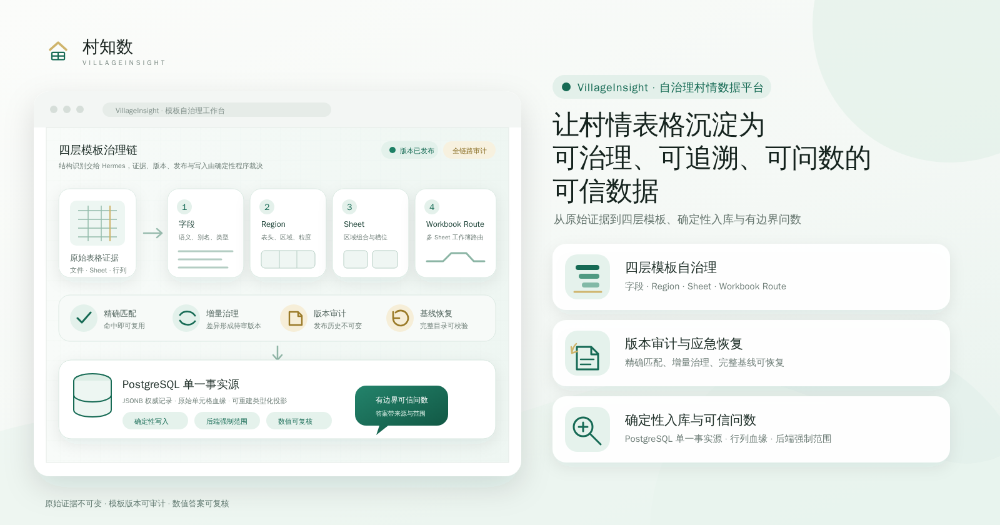

<p align="center">
  
</p>

# VillageInsight（村知数）

VillageInsight 是面向村情结构化资料的模板化解析、批量入库和可信问数平台。文件物理
证据经模板和人工审核后确定性写入 PostgreSQL；Hermes 只规划结构、语义和受控查询，
不创建源证据，也不直接写入事实。

## 五分钟快速开始

以下流程适合本机、开发虚拟机、联调和演示。需要 Docker、Python 3.13、`uv`、Node.js
和 npm；应用数据只写入 PostgreSQL，不会因启动或重启自动导入样例业务记录。

### 1. 配置并启动

在项目根目录执行：

```bash
cp .env.example .env
cp docker/.env.example docker/.env
./app.sh
./app.sh status
```

`app.sh` 会构建前端、启动 PostgreSQL、执行 Alembic 迁移、安全准备模型凭据加密密钥，
然后幂等初始化账号并启动 API、三个 Worker 和前端。默认账号为：

- `admin`：平台管理员，默认密码 `VillageInsight-ChangeMe-2026`；
- `demo`：演示数据操作员，密码相同，默认绑定“演示租户 / 示例乡镇 / 演示一村”。

### 2. 打开页面

- 应用与浏览器在同一台机器：<http://localhost:9137>
- 应用运行在虚拟机、浏览器运行在宿主机：`http://<虚拟机IP>:9137`

查询虚拟机 IP：

```bash
hostname -I
```

Web 默认监听 `0.0.0.0:9137`，因此桥接网络下宿主机可以直接使用虚拟机 IP。NAT 网络
需要把宿主机端口转发到虚拟机 TCP 9137；虚拟机防火墙也要放行 TCP 9137。API 默认只
监听虚拟机内部的 `127.0.0.1:9138`，由前端代理访问，不需要向宿主机开放 9138。

如果虚拟机启用了 UFW，可以执行：

```bash
sudo ufw allow 9137/tcp
```

不要在浏览器中访问 `http://0.0.0.0:9137`；`0.0.0.0` 是监听地址，不是客户端地址。

## 导入模板和样例数据

仓库提供一套完全合成的“演示一村”数据：户籍人口 180 人、60 户，党员 120 人，共
300 条正式记录，并附带 231 道问数金标。以下操作只能连接测试数据库，不要把样例上传
到真实村的业务范围。

### 1. 恢复四层模板

`./app.sh` 已完成数据库迁移。先检查恢复包并预演：

```bash
./scripts/restore-four-layer-baseline.sh --list
./scripts/restore-four-layer-baseline.sh \
  --baseline current-205-expanded --dry-run
```

确认命令显示的目标数据库和变更内容后，执行交互式恢复：

```bash
./scripts/restore-four-layer-baseline.sh \
  --baseline current-205-expanded
```

该操作只恢复版本化四层模板，不导入样例业务记录。日常操作保留交互确认；仅一次性隔离
测试库或 CI 才使用 `--yes`。

### 2. 验证样例被模板精确覆盖

```bash
uv run python -m village_insight.synthetic_dataset validate \
  --output-directory sample-data/synthetic-village-v1 \
  --report sample-data/synthetic-village-v1/template-coverage-report.json
```

结果必须包含 `accepted: true`。户籍人口应为字段 9/9 exact，党员名册应为字段 13/13
exact；两者的 Region、Sheet、Workbook Route 都必须命中指定 ID 和版本，且
`requires_hermes=false`。

### 3. 上传两份样例文件

使用 `demo` 登录，进入“批次”，点击“新建导入”并选择“批量上传”，一次选择：

- `sample-data/synthetic-village-v1/data/演示一村户籍人口.xlsx`
- `sample-data/synthetic-village-v1/data/演示一村党员名册.xlsx`

批次名称可以填写“演示一村合成数据验收”。两个文件处理完成后不应进入 Hermes 复核，
正式记录数应分别为 180 和 120，总计 300。

### 4. 配置模型并测试问数

仅导入上述精确模板样例不需要模型。需要测试问数时，先使用 `admin` 登录“设置”，选择
供应商并填写 Base URL、快速模型、推理模型和 API Key，连接测试通过后保存；再使用
`demo` 进入“问题”，选择演示一村和刚导入的文件。

最小人工冒烟测试：

- “演示一村户籍人口表共有多少人？”应答 `180人`；
- “演示一村户籍人口表共有多少户？”应答 `60户`；
- “演示一村党员名册共有多少人？”应答 `120人`；
- 请求身份证或电话号码时，应拒绝返回直接敏感标识符。

题库位于 `sample-data/synthetic-village-v1/questions.xlsx`，机器可比对结果位于
`questions.json` 和 `expected-results.json`。制品清单和重新生成方法见
[合成村情数据集说明](sample-data/synthetic-village-v1/README.md)。

## 日常启停和排障

```bash
./app.sh status
./app.sh logs                 # 汇总跟踪全部日志
./app.sh logs api             # 只跟踪 API
./app.sh logs worker-hermes   # 只跟踪 Hermes Worker
./app.sh restart
./app.sh stop                 # 停止应用进程，保留 PostgreSQL
./app.sh foreground           # 前台启动，便于调试
```

PID 保存在 `data/run/`，日志保存在 `logs/`。单个日志默认到 20MB 后轮转并保留 5 份，
可以通过 `LOG_MAX_BYTES` 和 `LOG_BACKUP_COUNT` 调整。

| 现象 | 命令 | 日志文件 |
| --- | --- | --- |
| 启动、构建、迁移或端口冲突 | `./app.sh logs supervisor` | `logs/supervisor.log` |
| 登录、页面请求或接口 500 | `./app.sh logs api` | `logs/api.log` |
| 文件解析或模板匹配失败 | `./app.sh logs worker-parse` | `logs/worker-parse.log` |
| Hermes 识别或模型调用失败 | `./app.sh logs worker-hermes` | `logs/worker-hermes.log` |
| 正式入库或 JSONB 物化失败 | `./app.sh logs worker-materialize` | `logs/worker-materialize.log` |
| 前端静态资源问题 | `./app.sh logs frontend` | `logs/frontend.log` |

快速检索常见错误：

```bash
rg -n "ERROR|Traceback|Exception|失败" logs/
```

日志不得新增原始身份证号、银行卡号、手机号或人员姓名等敏感值。

## 模型配置与 settings.key

Hermes 默认启用，但项目不预设供应商和模型。设置页保存的数据库配置优先于根目录
`.env` 中的 `HERMES_*` 环境变量；业务代码再按调用策略选择快速模型或推理模型。

模型 API Key 使用 `data/secrets/settings.key` 加密。启动预检遵循以下规则：

- 新数据库没有模型密文时，可以自动创建新密钥；
- 已有密钥只复用和校验，不覆盖；
- 数据库已有加密凭据但密钥缺失时，应用继续启动，但 Hermes 识别和问数降级不可用；
- 设置页保留供应商、Base URL 和模型，并提示重新录入 API Key；明确提交新 Key 后才生成
  新密钥并覆盖对应旧密文；
- 不要通过删除 `settings.key` 解决解密错误，否则会制造新的密文与密钥不匹配；
- 迁移数据库时必须同时迁移原 `settings.key`，不得用随机新文件覆盖。

宿主机模式和全容器模式共用同一文件。全容器启动中的一次性 `secret-init` 服务负责
创建、检查和设置共享权限；Worker 始终只读。API 仅为“缺失密钥后明确重新录入 Key”的
恢复路径保留写权限，不会在启动时用随机密钥覆盖已有密文。

## 两种运行模式

| 模块 | 宿主机进程模式 | 全容器模式 |
| --- | --- | --- |
| PostgreSQL | Docker Compose 容器 | Docker Compose 容器 |
| API | 宿主机 `uvicorn` | `api` 容器 |
| Worker | 宿主机三个独立进程 | 三个独立容器 |
| 前端 | Vite Preview 提供构建产物 | Nginx 容器 |
| 入口 | `app.sh` | `docker compose --profile application` |
| 用途 | 开发、联调、虚拟机演示、单机验收 | 可重复构建的服务器部署基础 |

### 宿主机进程模式（推荐快速开始）

```bash
./app.sh
```

可用环境变量覆盖监听地址和端口：

```bash
HOST=0.0.0.0 PORT=9137 API_HOST=127.0.0.1 API_PORT=9138 ./app.sh
```

该模式只有 PostgreSQL 在容器中。前端是构建后的 Vite Preview，适合开发和验收，不是
正式 Web 服务器；生产部署应使用全容器模式或正式编排系统。

### 全容器模式（服务器部署基础）

首次启动和每次重建时传入当前宿主机用户 UID/GID，使宿主机进程和 UID 10001 的应用
容器可以共用同一密钥：

```bash
VI_HOST_UID="$(id -u)" \
VI_HOST_GID="$(id -g)" \
docker compose --env-file docker/.env --profile application up --build -d
docker compose --env-file docker/.env --profile application ps
```

默认访问：

- Web：<http://localhost:5173>，虚拟机部署时使用 `http://<虚拟机IP>:5173`；
- API：仅在服务器或虚拟机内部访问 <http://localhost:8000>；
- API 文档：仅在服务器或虚拟机内部访问 <http://localhost:8000/docs>。

Web 默认监听 `0.0.0.0:5173`，API 默认只映射到 `127.0.0.1:8000`。宿主机浏览器通过
Web 的同源 `/api` 代理使用系统，不需要放行 8000。

全容器模式中的 API 和三个 Worker 使用 `docker/.env` 的
`POSTGRES_APPLICATION_URL`，主机名必须是 `postgres`、端口必须是 `5432`。宿主机上的
Alembic 和 `app.sh` 继续使用根目录 `.env` 的 `DATABASE_URL`。

## 配置文件与生产检查

两份配置文件职责不同：

- 根目录 `.env`：API、Worker、Hermes、上传目录、浏览器安全和初始化账号；
- `docker/.env`：PostgreSQL 镜像、数据库身份、容器连接、宿主机端口和资源参数。

修改数据库密码时必须同步：

- `docker/.env` 的 `POSTGRES_PASSWORD`；
- 根目录 `.env` 的 `DATABASE_URL`；
- 全容器模式下 `docker/.env` 的 `POSTGRES_APPLICATION_URL`。

生产环境必须修改数据库密码、`BOOTSTRAP_PASSWORD`、可信来源和安全 Cookie 配置，并
限制配置文件权限：

```bash
chmod 600 .env docker/.env
```

### PostgreSQL 镜像与数据目录

默认镜像为 `postgres:17-alpine`。官方仓库不可达时，可以在 `docker/.env` 配置经过
验收并固定摘要的镜像。切换镜像源不会自动证明镜像内容一致，必须保留版本和摘要记录。

`POSTGRES_DATA_DIR` 留空时使用命名卷 `village_insight_postgres_data`；生产环境可以配置
绝对路径，例如：

```dotenv
POSTGRES_DATA_DIR=/opt/village-insight/data/postgres/data
```

已有命名卷时不能直接改为一个空目录后重启。空目录会初始化成新数据库集群，原命名卷
不会自动复制。切换前必须停止写入、生成并校验备份、准备目录权限、恢复数据并完成登录、
批次、问数和记录数对账；验收完成前不得删除原卷。

### PostgreSQL 容量与参数

默认参数面向单机批量入库：`shared_buffers=512MB`、`work_mem=4MB`、
`max_wal_size=1GB`、`min_wal_size=256MB`、`wal_compression=on`。生产环境应在压测后
调整，不要按主机总内存直接放大每连接的 `work_mem`。

数据盘建议按“当前数据库与 WAL 占用的 2 倍，再额外保留至少 10GB”规划。健康检查要求
PGDATA 至少保留 `POSTGRES_MIN_FREE_DISK_MB`，默认 4096MB；同时应设置磁盘使用率
80%/90% 告警。

8GB 内存、独立 SSD 的起始配置示例：

```dotenv
POSTGRES_SHARED_BUFFERS=1GB
POSTGRES_EFFECTIVE_CACHE_SIZE=4GB
POSTGRES_WORK_MEM=4MB
POSTGRES_MAINTENANCE_WORK_MEM=256MB
POSTGRES_MAX_WAL_SIZE=2GB
POSTGRES_MIN_WAL_SIZE=512MB
POSTGRES_MIN_FREE_DISK_MB=10240
```

## 备份与服务器迁移

### 四层模板应急恢复

```bash
./scripts/restore-four-layer-baseline.sh --list
./scripts/restore-four-layer-baseline.sh --dry-run
./scripts/restore-four-layer-baseline.sh \
  --baseline current-205-expanded --dry-run
```

恢复点清单位于 `config/four-layer-recovery-baselines.json`，制品位于
`recovery/four-layer-baselines/`。恢复工具校验 SHA-256、包逻辑摘要和四层数量，并在
一个事务中恢复模板；它不写入用户、上传文件、批次、业务记录或问答数据。

### PostgreSQL 全量备份与恢复

```bash
# 备份
mkdir -p backups
docker compose --env-file docker/.env exec -T postgres sh -c \
  'pg_dump -U "$POSTGRES_USER" -d "$POSTGRES_DB" -Fc' \
  > ./backups/village_insight.dump

# 恢复；先启动目标 PostgreSQL
docker compose --env-file docker/.env exec -T postgres sh -c \
  'pg_restore -U "$POSTGRES_USER" -d "$POSTGRES_DB" \
    --clean --if-exists --no-owner --no-privileges' \
  < ./backups/village_insight.dump
```

完整业务迁移还必须带上数据库实际引用的原始文件和原
`data/secrets/settings.key`。`scripts/create-server-transfer-bundle.py` 会按数据库引用收集
源文件并按 SHA-256 去重；`scripts/verify-server-transfer-bundle.py` 在恢复前做离线完整性
校验。完整门禁见[服务器整库迁移实施方案](docs/服务器整库迁移/实施方案.md)。

## 开发与验证

分别启动组件：

```bash
docker compose --env-file docker/.env up -d postgres
uv run alembic upgrade head
uv run village-insight-secret-preflight
uv run village-insight-bootstrap
uv run uvicorn village_insight.api.app:app --reload
```

另一个终端启动 Worker：

```bash
uv run village-insight-worker
```

前端开发服务：

```bash
cd frontend
npm install
npm run dev
```

完整代码检查：

```bash
make check
```

窄到宽的主要命令为：

```bash
uv run pytest
uv run ruff check .
uv run mypy src
cd frontend && npm run type-check
cd frontend && npm run test
cd frontend && npm run build
```

## 架构边界与当前能力

```text
文件物理证据
→ 开源解析适配器生成结构候选
→ Hermes 结构与语义规划
→ 人工审核版本化模板
→ 确定性写入 PostgreSQL
→ 指标化问数
```

- PostgreSQL 是唯一事实来源，原始物理证据不可变；
- API、租约任务队列和解析、Hermes、物化三个独立 Worker；
- `.xlsx` 流式物理解析及 `.xls`、`.csv` 适配；
- 字段注册、四层模板版本、审核事件、不可变导入计划和单元格血缘；
- PostgreSQL JSONB 权威记录、可重建投影、质量隔离和确定性指标查询；
- 用户工作台与管理端双 Shell、固定角色、租户及村级后端强制授权；
- 数据库持久化的多供应商模型配置、加密 API Key 和输出限制；
- Docker Compose 环境及 pytest、Ruff、mypy、Vitest、TypeScript 和构建检查。

开放源代码解析器只通过适配器接入，不引入它们的 RAG、向量、图或任务栈。数值答案来自
受控确定性查询，不由模型自由计算。

## Hermes 说明

业务代码依赖 `HermesRuntime` 接口。`hermes-agent==0.19.0` 是固定 Python 依赖，程序
直接使用 `from run_agent import AIAgent`，不启动独立 Gateway。检查安装：

```bash
uv run village-insight-hermes-check
```

每个任务创建一个 Hermes `AIAgent`，供应商、协议、Base URL 和模型由设置页或环境配置
决定。Hermes 不能创建源证据，不能绕过模板发布和审核，也不能直接写入事实。

## 文档与验收状态

- [结构化文档入库与问数平台实施方案](docs/结构化文档入库与问数平台实施方案.md)
- [多租户、行政区划与数据权限实施方案](docs/多租户行政区划与数据权限实施方案.md)
- [开发约定](docs/development.md)
- [Hermes 内嵌运行说明](docs/hermes-embedded.md)
- [README 快速开始与 settings.key 改造方案](plans/readme-quickstart-and-settings-key.md)

真实业务文件闭环只有在上传、识别、审核、物化、查询和证据验收全部通过后才能声明业务
基线通过。旧语料分析、工具运行或小样本成功不能替代端到端验收：

- [阶段 2 中间验收](docs/research/stage-05-materialization/ACCEPTANCE-2026-07-29.md)
- [阶段 3 中间验收](docs/research/stage-03-batch-review/ACCEPTANCE-2026-07-29.md)
