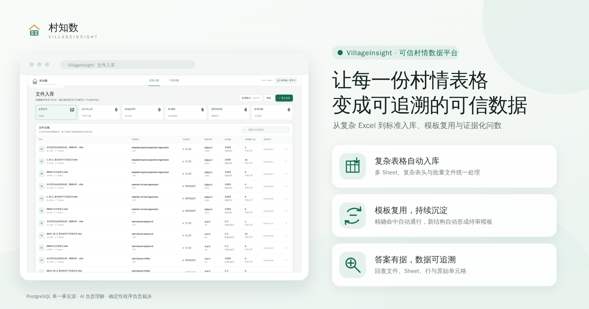

<p align="center">
  
</p>

# VillageInsight（村知数）

VillageInsight 是面向村情结构化资料的模板化解析、批量入库和可信问数平台。

项目坚持一条可审计的数据链路：

```text
文件物理证据
→ 开源解析能力生成结构候选
→ Hermes 结构与语义规划
→ 人工审核模板
→ 确定性写入 PostgreSQL
→ 指标化问数
```

## 当前能力

- FastAPI API；
- PostgreSQL 数据模型和 Alembic；
- PostgreSQL 租约任务队列；
- 独立 Worker；
- `.xlsx` 流式物理证据解析、`.xls`/`.csv` 适配；
- Hermes 直接 import 的适配边界；
- 批量文件上传和白名单服务端目录扫描；
- 字段注册、模板版本、审核事件和不可变导入计划；
- 精确/差异模板匹配和 Hermes 增量字段建议；
- PostgreSQL JSONB 权威记录、可重建类型化投影、单元格血缘和质量问题；
- 全量语料去重、布局聚类、可审核模板种子和幂等导入；
- React 用户工作台/管理端双 Shell、真实 URL 路由和页面级拆包；
- PostgreSQL 用户会话、租户成员、乡镇/村行政范围和后端强制授权；
- 可持久化的 LLM 提供商、模型、API Key 和输出上限配置页；
- Docker Compose 本地环境；
- pytest、Ruff、mypy、Vitest 和前端类型检查。

## 快速开始

推荐在项目根目录使用统一启动脚本：

```bash
./app.sh
```

脚本会启动 PostgreSQL、执行数据库迁移，并拉起 API、Worker 和前端。默认访问地址为
<http://localhost:9137>，监听地址和端口可通过环境变量覆盖：

```bash
HOST=0.0.0.0 PORT=9137 ./app.sh
```

首次启动时，如果 `.env` 不存在，脚本会从 `.env.example` 创建它。Hermes 默认关闭；
需要启用时，请先在 `.env` 中配置相应模型和密钥。

开发环境首次启动会按 `.env` 中的 `BOOTSTRAP_*` 配置创建一个业务租户、一个村和
两个固定职责账号：

- `tenant-admin`：可在租户范围问答，并选择下属村上传；
- `village-operator`：可以上传并查询所属村；

`.env.example` 中的密码仅用于本地首次启动，启动前必须修改。已有 `.env` 的开发环境
需要手工补充 `BOOTSTRAP_TENANT_NAME`、`BOOTSTRAP_TOWNSHIP_NAME`、
`BOOTSTRAP_VILLAGE_NAME` 和 `BOOTSTRAP_PASSWORD`。生产环境不得使用示例凭据。

需要创建管理员租户、X租户、六个村级测试账号、租户管理员 `x` 和平台管理员 `admin`
时，执行：

```bash
uv run alembic upgrade head
uv run village-insight-demo-identities
```

该命令只补齐或修复测试组织关系，不会重置用户已修改的密码。账号清单见
[`docs/多租户行政区划与数据权限实施方案.md`](docs/多租户行政区划与数据权限实施方案.md)；
生产环境禁止运行。

也可以分别启动各组件：

```bash
cp .env.example .env
docker compose up -d postgres
uv run alembic upgrade head
```

这一步只启动 PostgreSQL。需要以容器方式启动整个应用时：

```bash
docker compose --profile application up --build
```

当前唯一外部基础组件是 PostgreSQL。首期不启动 Redis/Valkey、MinIO、
Elasticsearch/OpenSearch/Infinity、MySQL、Neo4j 或独立 Hermes Gateway。
批量任务队列使用 PostgreSQL；上传文件使用挂载卷；Hermes 安装在应用 Python
环境内。出现经过压测证明的瓶颈后，再单独评估 Redis 或对象存储。

容器部署默认访问：

- Web：<http://localhost:5173>
- API：<http://localhost:8000>
- API 文档：<http://localhost:8000/docs>

本机开发：

```bash
uv sync --all-extras
uv run alembic upgrade head
uv run uvicorn village_insight.api.app:app --reload
```

另一个终端运行 Worker：

```bash
uv run village-insight-worker
```

前端：

```bash
cd frontend
npm install
npm run dev
```

`./app.sh` 本机开发默认访问 Web <http://localhost:9137>、API
<http://localhost:9138>。登录后的路由由后端返回的固定角色决定：村级数据员使用
`/batches`、`/questions`；租户管理员使用相同入口但可以选择本租户任意村；平台
管理员进入 `/admin/access`、`/admin/reviews`、`/admin/records`、
`/admin/catalog` 和 `/admin/settings`。

## 备份与服务器迁移

新环境从零初始化不需要数据文件：`docker compose up -d postgres` 后执行
`uv run alembic upgrade head` 即可建出全部表结构，首次启动再按 `BOOTSTRAP_*`
自动创建初始租户和账号。

需要把现有数据整体迁移到服务器时，使用 PostgreSQL 全量备份：

```bash
# 备份（本机）
docker exec village-insight-postgres-1 pg_dump -U village_insight -d village_insight \
  -Fc -f /tmp/village_insight.dump
docker cp village-insight-postgres-1:/tmp/village_insight.dump ./backups/

# 恢复（服务器，先 docker compose up -d postgres）
docker cp ./backups/village_insight.dump village-insight-postgres-1:/tmp/restore.dump
docker exec village-insight-postgres-1 pg_restore -U village_insight -d village_insight \
  --clean --if-exists --no-owner --no-privileges /tmp/restore.dump
```

备份中已包含 `alembic_version`，启动时 `alembic upgrade head` 会自动对齐后续迁移。
除数据库外，迁移完整业务数据还需要带上两部分文件：

- 上传的原始文件：Docker 卷 `village_insight_upload_data`（容器内 `/data/uploads`）；
- 设置密钥 `SECRET_KEY_PATH`（默认 `./data/secrets/settings.key`）：设置页保存的
  LLM API Key 用它加密，缺失时已存密钥无法解密，需在设置页重新录入。

## 验证

```bash
make check
```

## 文档

- [结构化文档入库与问数平台实施方案](docs/结构化文档入库与问数平台实施方案.md)
- [多租户、行政区划与数据权限实施方案](docs/多租户行政区划与数据权限实施方案.md)
- [开发约定](docs/development.md)
- [Hermes 内嵌运行说明](docs/hermes-embedded.md)

## Hermes 说明

业务代码只依赖 `HermesRuntime` 接口。运行时通过内部固定版本 wheel 提供：

```python
from run_agent import AIAgent
```

默认关闭 Hermes。`hermes-agent==0.19.0` 已作为固定 Python 依赖安装到
API/Worker 环境，由程序直接 `from run_agent import AIAgent`，不启动 Gateway。
可运行 `uv run village-insight-hermes-check` 检查安装。本地模型使用
SiliconFlow 托管的 DeepSeek V4：普通请求使用
`deepseek-ai/DeepSeek-V4-Flash`，需要思考的疑难请求使用
`deepseek-ai/DeepSeek-V4-Pro`。密钥可以通过环境变量注入，也可以在设置页加密
保存；业务代码通过调用策略选择模型。

## 真实文件验收状态

按修订后的实施门禁，真实业务文件闭环只能在阶段 0—6 的方案实现完成后开始。
旧版本做过的语料分析和技术运行不能替代新的端到端验收，也不能声明业务基线通过。

当前已完成首个实施批次：JSONB 权威记录、导入来源、证据/正式状态分离、
用户/管理双 Shell 和真实 Chromium 回归。阶段 2、3 仍有明确未完成项，详见：

- [阶段 2 中间验收](docs/research/stage-05-materialization/ACCEPTANCE-2026-07-29.md)
- [阶段 3 中间验收](docs/research/stage-03-batch-review/ACCEPTANCE-2026-07-29.md)
